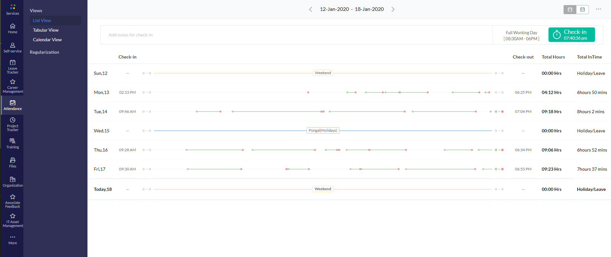

# zoho-intime

## run locally

- In Chrome, open `chrome://extensions/`
- Click + Developer mode
- Click Load unpacked extension…
- Navigate to `src` and click OK
- go to attendance and navigate to listview and enjoy

## Screeenshots

## TODO
- [x] Run whenever zoho attendance list view url is visited
- [ ] if switched between tabular view and list view, zoho doesent rerender the listview dom, so this causes to add more `Total InTime`columns
- [ ] find a way to get this working in monthly view, ref: https://stackoverflow.com/questions/9776054/addeventlistener-in-content-script-not-working
- [ ] handle edge cases:
    - [ ] coming before 8:30
    - [x] going after 6
 
